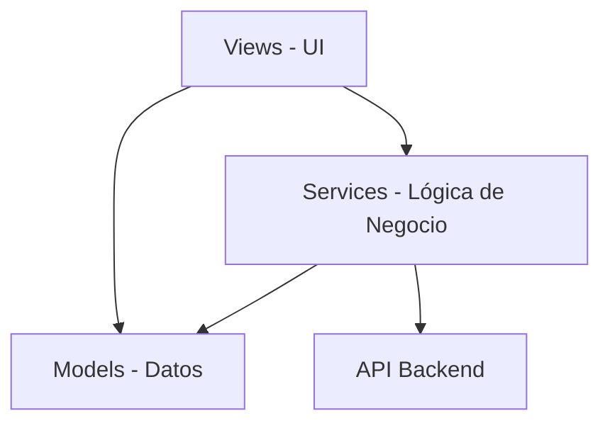
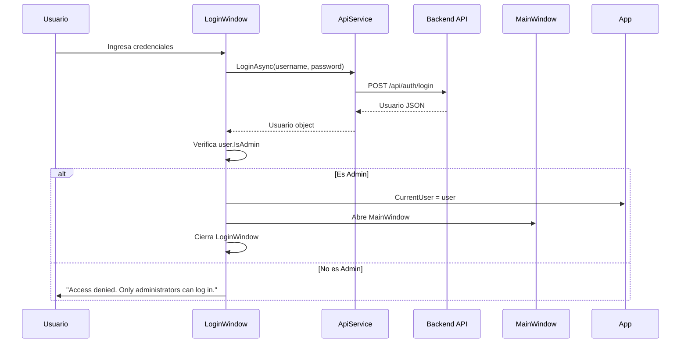

# 📚 Documentación Técnica - InfoCam Desktop

## 📋 Índice

1. [Visión General del Proyecto](#visión-general-del-proyecto)
2. [Arquitectura de la Aplicación](#arquitectura-de-la-aplicación)
3. [Modelos de Datos](#modelos-de-datos)
4. [Servicios](#servicios)
5. [Vistas y Componentes UI](#vistas-y-componentes-ui)
6. [Flujo de Autenticación](#flujo-de-autenticación)
7. [Gestión de Datos](#gestión-de-datos)
8. [Características Principales](#características-principales)

---

## Visión General del Proyecto

**InfoCam** es una aplicación de escritorio WPF (Windows Presentation Foundation) desarrollada en C# para gestionar cámaras de tráfico e incidencias del País Vasco. La aplicación se conecta a una API REST backend para realizar operaciones CRUD y visualizar datos en tiempo real.

### Tecnologías Utilizadas

- **Framework**: .NET Framework 4.7.2
- **UI**: WPF (Windows Presentation Foundation)
- **Serialización**: DataContractJsonSerializer
- **Comunicación HTTP**: HttpClient
- **Generación de PDF**: PdfSharp
- **Visualización Web**: WebView2

### Estructura del Proyecto

```
InfoCam/
├── Models/              # Modelos de datos
├── Services/            # Servicios de negocio y API
├── Views/               # Vistas XAML y code-behind
├── Resources/           # Recursos compartidos (estilos)
└── Properties/          # Configuración del proyecto
```

---

## Arquitectura de la Aplicación

### Patrón Arquitectónico

La aplicación sigue un patrón **MVVM simplificado** con separación de responsabilidades:



### Componentes Principales

1. **Models**: Clases POCO (Plain Old CLR Objects) que representan entidades de datos
2. **Services**: Capa de servicios para comunicación con API y generación de reportes
3. **Views**: Interfaces de usuario XAML con code-behind
4. **Resources**: Estilos y recursos compartidos

---

## Modelos de Datos

### 1. Usuario (`Usuario.cs`)

Representa un usuario del sistema con capacidades administrativas.

```csharp
[DataContract]
public class Usuario
{
    [DataMember(Name = "id")]
    public long Id { get; set; }

    [DataMember(Name = "username")]
    public string Username { get; set; }

    [DataMember(Name = "password")]
    public string Password { get; set; }

    [DataMember(Name = "nombre")]
    public string Nombre { get; set; }

    [DataMember(Name = "apellido")]
    public string Apellido { get; set; }

    [DataMember(Name = "email")]
    public string Email { get; set; }

    [DataMember(Name = "is_admin")]
    public bool IsAdmin { get; set; }

    [DataMember(Name = "telefono")]
    public int Telefono { get; set; }
}
```

**Características**:
- Atributo `[DataContract]` para serialización JSON
- Propiedad `IsAdmin` para control de acceso
- Todos los campos necesarios para gestión completa de usuarios

---

### 2. Camera (`Camera.cs`)

Representa una cámara de tráfico con su ubicación y estado.

```csharp
[DataContract]
public class Camera
{
    [DataMember(Name = "id")]
    public int Id { get; set; }

    [DataMember(Name = "nombre")]
    public string Nombre { get; set; }

    // Propiedades de coordenadas con conversión string-double
    [DataMember(Name = "latitud")]
    public string LatitudString { get; set; }

    [IgnoreDataMember]
    public double Latitud { get; set; }

    [DataMember(Name = "longitud")]
    public string LongitudString { get; set; }

    [IgnoreDataMember]
    public double Longitud { get; set; }

    [DataMember(Name = "imagen")]
    public string Imagen { get; set; }

    [DataMember(Name = "activa")]
    public bool Activa { get; set; }
}
```

**Características Especiales**:
- **Conversión de Coordenadas**: Usa propiedades string para serialización y propiedades double para uso interno
- **Parsing Robusto**: Maneja diferentes formatos de números (comas/puntos)
- **Estado Activo**: Indica si la cámara está operativa

---

### 3. Incidencia (`Incidencia.cs`)

Representa una incidencia de tráfico con ubicación y fechas.

```csharp
[DataContract]
public class Incidencia
{
    [DataMember(Name = "id", EmitDefaultValue = false)]
    public long Id { get; set; }

    [DataMember(Name = "tipoIncidencia")]
    public string TipoIncidencia { get; set; }

    [DataMember(Name = "causa")]
    public string Causa { get; set; }

    [DataMember(Name = "nombre")]
    public string Nombre { get; set; }

    // Fechas con conversión DateTime-String
    [DataMember(Name = "fecha_inicio")]
    public string Fecha_inicio_String { get; set; }

    [IgnoreDataMember]
    public DateTime? Fecha_inicio { get; set; }

    [DataMember(Name = "fecha_fin")]
    public string Fecha_fin_String { get; set; }

    [IgnoreDataMember]
    public DateTime? Fecha_fin { get; set; }

    // Coordenadas
    [DataMember(Name = "latitud")]
    public string LatitudString { get; set; }

    [IgnoreDataMember]
    public double Latitud { get; set; }

    [DataMember(Name = "longitud")]
    public string LongitudString { get; set; }

    [IgnoreDataMember]
    public double Longitud { get; set; }

    // Usuario que creó la incidencia
    [DataMember(Name = "usuario")]
    public Usuario Usuario { get; set; }
}
```

**Características Especiales**:
- **Conversión de Fechas**: Serializa en formato ISO 8601 (`ToString("o")`)
- **Nullable DateTime**: Permite fechas opcionales
- **Coordenadas**: Mismo patrón de conversión que Camera

---

## Servicios

### 1. ApiService (`ApiService.cs`)

Servicio principal para comunicación con la API REST backend.

#### Configuración

```csharp
private const string BaseUrl = "http://10.10.16.85:8080/api";
private readonly HttpClient _client;
```

#### Métodos Principales

**Autenticación**:
```csharp
public async Task<Usuario> LoginAsync(string username, string password)
{
    // 1. Envía credenciales al endpoint /auth/login
    // 2. Deserializa la respuesta a objeto Usuario
    // 3. Retorna el usuario (incluyendo flag is_admin)
    // 4. Retorna null si falla la autenticación
}
```

**Gestión de Usuarios**:
```csharp
// Obtener todos los usuarios
public async Task<List<Usuario>> GetUsuariosAsync()

// Crear nuevo usuario
public async Task<bool> CreateUsuarioAsync(Usuario usuario)

// Actualizar usuario existente
public async Task<bool> UpdateUsuarioAsync(Usuario usuario)

// Eliminar usuario
public async Task<bool> DeleteUsuarioAsync(long id)
```

**Gestión de Cámaras**:
```csharp
// Obtener todas las cámaras
public async Task<List<Camera>> GetCamerasAsync()

// Obtener solo cámaras activas
public async Task<List<Camera>> GetActiveCamerasAsync()

// Eliminar cámara
public async Task<bool> DeleteCameraAsync(int id)
```

**Gestión de Incidencias**:
```csharp
// Obtener todas las incidencias
public async Task<List<Incidencia>> GetIncidenciasAsync()

// Obtener tipos de incidencias
public async Task<List<string>> GetTiposIncidenciasAsync()

// Obtener incidencias activas por fecha
public async Task<List<Incidencia>> GetActiveIncidenciasAsync(string date)

// Crear incidencia
public async Task<bool> CreateIncidenciaAsync(Incidencia incidencia)

// Actualizar incidencia
public async Task<bool> UpdateIncidenciaAsync(Incidencia incidencia)

// Eliminar incidencia
public async Task<bool> DeleteIncidenciaAsync(long id)
```

#### Patrón de Implementación

Todos los métodos siguen un patrón consistente:

1. **Serialización**: Convierte objetos C# a JSON usando `DataContractJsonSerializer`
2. **HTTP Request**: Usa `HttpClient` para enviar peticiones
3. **Manejo de Respuesta**: Verifica `IsSuccessStatusCode`
4. **Deserialización**: Convierte JSON de respuesta a objetos C#
5. **Manejo de Errores**: Lanza excepciones o retorna null/false

---

### 2. ReportService (`ReportService.cs`)

Servicio para generación de reportes PDF usando PdfSharp.

#### Funcionalidades

- Generación de reportes de cámaras
- Generación de reportes de incidencias
- Formato profesional con gráficos y tablas
- Exportación a PDF

---

## Vistas y Componentes UI

### Arquitectura de Vistas

La aplicación usa un diseño de **ventana principal con navegación lateral**:

```
┌─────────────────────────────────────┐
│  MainWindow                         │
│  ┌─────────┬────────────────────┐  │
│  │ Sidebar │  Content Area      │  │
│  │         │                    │  │
│  │ Cámaras │  [Vista Dinámica]  │  │
│  │ Incid.  │                    │  │
│  │ Mapa    │                    │  │
│  │ Usuario │                    │  │
│  └─────────┴────────────────────┘  │
└─────────────────────────────────────┘
```

---

### 1. LoginWindow

**Propósito**: Autenticación de usuarios administradores.

**Características**:
- Validación de credenciales
- **Restricción de acceso**: Solo usuarios con `is_admin = true` pueden acceder
- Almacenamiento del usuario actual en `App.CurrentUser`
- Mensajes de error descriptivos

**Flujo de Login**:
```csharp
private async void LoginButton_Click(object sender, RoutedEventArgs e)
{
    // 1. Validar campos no vacíos
    // 2. Llamar a ApiService.LoginAsync()
    // 3. Verificar que user.IsAdmin == true
    // 4. Guardar en App.CurrentUser
    // 5. Abrir MainWindow
    // 6. Cerrar LoginWindow
}
```

---

### 2. MainWindow

**Propósito**: Ventana principal con navegación y área de contenido dinámica.

**Componentes**:
- **Sidebar**: Botones de navegación
- **Header**: Búsqueda global y generación de reportes
- **Content Area**: Área dinámica que muestra diferentes vistas

**Navegación**:
```csharp
private void ShowCameras_Click(object sender, RoutedEventArgs e)
{
    MainContent.Content = new CamerasView();
}

private void ShowIncidencias_Click(object sender, RoutedEventArgs e)
{
    MainContent.Content = new IncidenciasView();
}

private void ShowMap_Click(object sender, RoutedEventArgs e)
{
    MainContent.Content = new MapView();
}

private void ShowUsuarios_Click(object sender, RoutedEventArgs e)
{
    MainContent.Content = new UsuariosView();
}
```

**Búsqueda Global**:
```csharp
private void GlobalSearchBox_TextChanged(object sender, TextChangedEventArgs e)
{
    if (MainContent.Content is IActionableView view)
    {
        view.Filter(GlobalSearchBox.Text);
    }
}
```

---

### 3. CamerasView

**Propósito**: Visualización y gestión de cámaras de tráfico.

**Características**:
- DataGrid con todas las cámaras
- Filtrado en tiempo real
- Eliminación de cámaras
- Generación de reportes PDF

**Implementación**:
```csharp
public partial class CamerasView : UserControl, IActionableView
{
    private async Task LoadCamerasAsync()
    {
        _allCameras = await _apiService.GetCamerasAsync();
        CamerasGrid.ItemsSource = _allCameras;
    }

    public void Filter(string query)
    {
        var filtered = _allCameras.Where(c => 
            c.Nombre.ToLower().Contains(query.ToLower())
        ).ToList();
        CamerasGrid.ItemsSource = filtered;
    }
}
```

---

### 4. IncidenciasView

**Propósito**: Gestión completa de incidencias de tráfico.

**Características**:
- Listado de incidencias
- **Botones de acción**:
  - ➕ Nueva Incidencia
  - ✏ Editar
  - 🗑 Eliminar
- Filtrado por múltiples campos
- Selección múltiple para eliminación

**CRUD Operations**:
```csharp
private async void AddButton_Click(object sender, RoutedEventArgs e)
{
    var dialog = new IncidenciaFormWindow();
    if (dialog.ShowDialog() == true)
    {
        await _apiService.CreateIncidenciaAsync(dialog.Incidencia);
        await LoadIncidenciasAsync();
    }
}

private async void EditButton_Click(object sender, RoutedEventArgs e)
{
    var selected = (Incidencia)IncidenciasGrid.SelectedItem;
    var dialog = new IncidenciaFormWindow(selected);
    if (dialog.ShowDialog() == true)
    {
        await _apiService.UpdateIncidenciaAsync(dialog.Incidencia);
        await LoadIncidenciasAsync();
    }
}
```

---

### 5. IncidenciaFormWindow

**Propósito**: Formulario modal para crear/editar incidencias.

**Características Innovadoras**:

#### 🎚️ Sliders para Coordenadas
```csharp
// Sliders con rango específico del País Vasco
LatSlider: Minimum="41.5" Maximum="43.5"
LonSlider: Minimum="-3.5" Maximum="-1.5"

// Actualización en tiempo real
private void LatSlider_ValueChanged(object sender, RoutedPropertyChangedEventArgs<double> e)
{
    LatValueText.Text = LatSlider.Value.ToString("F2") + "°";
}
```

#### 📌 Ubicaciones Predefinidas
```csharp
private void UseLocationButton_Click(object sender, RoutedEventArgs e)
{
    var locations = new[]
    {
        new { Name = "Bilbao", Lat = 43.263, Lon = -2.935 },
        new { Name = "Vitoria-Gasteiz", Lat = 42.847, Lon = -2.672 },
        new { Name = "San Sebastián", Lat = 43.318, Lon = -1.981 }
    };
    
    var location = locations[random.Next(locations.Length)];
    LatSlider.Value = location.Lat;
    LonSlider.Value = location.Lon;
}
```

#### 📅 DatePickers para Fechas
- Fecha de inicio (obligatoria)
- Fecha de fin (opcional, debe ser posterior a inicio)
- Formato automático

#### ⚠️ Validación en Tiempo Real
El formulario incluye validaciones para asegurar la integridad de los datos:
- **Nombre**: Obligatorio
- **Tipo**: Obligatorio
- **Causa**: Obligatorio
- **Fecha Inicio**: Obligatoria
- **Lógica de Fechas**: La fecha de fin no puede ser anterior a la de inicio

---

### 6. UsuariosView

**Propósito**: Gestión completa de usuarios del sistema.

**Características**:
- CRUD completo de usuarios
- Visualización de todos los atributos (nombre, apellido, email, teléfono, admin)
- Filtrado por múltiples campos
- Botones de acción estilizados

**Columnas del DataGrid**:
- ID
- Usuario
- Nombre
- Apellido
- Email
- Teléfono
- Admin (CheckBox)

---

### 7. UserFormDialog

**Propósito**: Formulario modal para crear/editar usuarios.

**Validaciones Implementadas**:

```csharp
private void SaveButton_Click(object sender, RoutedEventArgs e)
{
    // 1. Validar campos obligatorios
    if (string.IsNullOrWhiteSpace(UsernameBox.Text))
    {
        ErrorText.Text = "El usuario es obligatorio.";
        return;
    }

    // 2. Validar formato de email
    if (!IsValidEmail(EmailBox.Text))
    {
        ErrorText.Text = "El formato del email no es válido.";
        return;
    }

    // 3. Validar teléfono numérico
    if (!int.TryParse(TelefonoBox.Text, out int telefono))
    {
        ErrorText.Text = "El teléfono debe ser un número válido.";
        return;
    }

    // 4. Guardar usuario
    Usuario.Username = UsernameBox.Text;
    Usuario.Password = PasswordBox.Password;
    // ... resto de campos
    
    DialogResult = true;
}

private bool IsValidEmail(string email)
{
    var regex = new Regex(@"^[^@\s]+@[^@\s]+\.[^@\s]+$");
    return regex.IsMatch(email);
}
```

---

### 8. MapView

**Propósito**: Visualización de cámaras e incidencias en mapa interactivo.

**Tecnología**: WebView2 para renderizar mapa web

**Características**:
- Visualización geográfica
- Marcadores de cámaras
- Marcadores de incidencias
- Interactividad

---

## Flujo de Autenticación

### Diagrama de Flujo



### Código de Autenticación

**LoginWindow.xaml.cs**:
```csharp
private async void LoginButton_Click(object sender, RoutedEventArgs e)
{
    Usuario user = await _apiService.LoginAsync(username, password);
    
    if (user != null)
    {
        if (user.IsAdmin)
        {
            App.CurrentUser = user;  // Guardar usuario global
            MainWindow mainWindow = new MainWindow();
            mainWindow.Show();
            this.Close();
        }
        else
        {
            StatusText.Text = "Access denied. Only administrators can log in.";
        }
    }
}
```

**App.xaml.cs**:
```csharp
public partial class App : Application
{
    public static Usuario CurrentUser { get; set; }  // Usuario global
}
```

---

## Gestión de Datos

### Patrón de Carga de Datos

Todas las vistas siguen un patrón consistente:

```csharp
public partial class ExampleView : UserControl, IActionableView
{
    private readonly ApiService _apiService;
    private List<Entity> _allEntities;

    public ExampleView()
    {
        InitializeComponent();
        _apiService = new ApiService();
        _allEntities = new List<Entity>();
        Loaded += ExampleView_Loaded;
    }

    private async void ExampleView_Loaded(object sender, RoutedEventArgs e)
    {
        await LoadEntitiesAsync();
    }

    private async Task LoadEntitiesAsync()
    {
        try
        {
            _allEntities = await _apiService.GetEntitiesAsync();
            EntitiesGrid.ItemsSource = _allEntities;
        }
        catch (Exception ex)
        {
            MessageBox.Show($"Error: {ex.Message}", "Error", 
                MessageBoxButton.OK, MessageBoxImage.Error);
        }
    }
}
```

### Patrón de Filtrado

```csharp
public void Filter(string query)
{
    if (_allEntities == null) return;

    if (string.IsNullOrWhiteSpace(query))
    {
        EntitiesGrid.ItemsSource = _allEntities;
    }
    else
    {
        var filtered = _allEntities.Where(e => 
            (e.Field1 != null && e.Field1.ToLower().Contains(query.ToLower())) ||
            (e.Field2 != null && e.Field2.ToLower().Contains(query.ToLower()))
        ).ToList();
        
        EntitiesGrid.ItemsSource = filtered;
    }
}
```

---

## Características Principales

### 1. Interfaz IActionableView

Define un contrato para vistas que soportan acciones globales:

```csharp
public interface IActionableView
{
    void Filter(string query);
    void GenerateReport();
}
```

**Beneficios**:
- Búsqueda global desde MainWindow
- Generación de reportes unificada
- Polimorfismo para diferentes vistas

---

### 2. Estilos Compartidos

**Styles.xaml** define estilos consistentes:

```xml
<!-- Colores del tema oscuro -->
<Color x:Key="BackgroundColor">#121212</Color>
<Color x:Key="SurfaceColor">#1E1E1E</Color>
<Color x:Key="AccentColor">#4CAF50</Color>
<Color x:Key="TextPrimaryColor">#FFFFFF</Color>

<!-- Estilos de botones -->
<Style x:Key="ModernButtonStyle" TargetType="Button">
    <Setter Property="Background" Value="#334455"/>
    <Setter Property="Foreground" Value="White"/>
    <Setter Property="Cursor" Value="Hand"/>
    <!-- ... -->
</Style>

<!-- Estilos de DataGrid -->
<Style TargetType="DataGrid">
    <Setter Property="Background" Value="{StaticResource SurfaceBrush}"/>
    <Setter Property="AlternatingRowBackground" Value="#252525"/>
    <!-- ... -->
</Style>
```

---

### 3. Manejo de Errores

Patrón consistente en toda la aplicación:

```csharp
try
{
    // Operación que puede fallar
    var result = await _apiService.SomeOperation();
    
    if (!result)
    {
        MessageBox.Show("Operación fallida", "Error", 
            MessageBoxButton.OK, MessageBoxImage.Error);
        return;
    }
    
    // Éxito
    MessageBox.Show("Operación exitosa", "Éxito", 
        MessageBoxButton.OK, MessageBoxImage.Information);
}
catch (Exception ex)
{
    MessageBox.Show($"Error: {ex.Message}", "Error", 
        MessageBoxButton.OK, MessageBoxImage.Error);
}
```

---

## Resumen de Funcionalidades

### ✅ Autenticación
- Login con validación de credenciales
- Restricción de acceso solo a administradores
- Sesión de usuario global

### ✅ Gestión de Usuarios
- CRUD completo
- Validación de formularios
- Filtrado y búsqueda

### ✅ Gestión de Cámaras
- Visualización de cámaras
- Eliminación
- Filtrado
- Generación de reportes

### ✅ Gestión de Incidencias
- CRUD completo
- Formulario con sliders para coordenadas
- Ubicaciones predefinidas
- DatePickers para fechas
- Filtrado avanzado

### ✅ Visualización
- Mapa interactivo
- DataGrids estilizados
- Tema oscuro moderno
- Diseño responsivo

### ✅ Reportes
- Generación de PDF
- Gráficos y tablas
- Exportación de datos

---

## Mejores Prácticas Implementadas

1. **Async/Await**: Todas las operaciones de red son asíncronas
2. **Try-Catch**: Manejo robusto de errores
3. **Validación**: Validación de entrada en formularios
4. **Separación de Responsabilidades**: Models, Services, Views
5. **Reutilización**: Estilos compartidos, interfaces comunes
6. **UX**: Mensajes claros, feedback visual, diseño intuitivo

---

## Conclusión

InfoCam es una aplicación WPF moderna y robusta que demuestra:
- Arquitectura limpia y mantenible
- Comunicación eficiente con APIs REST
- Interfaz de usuario profesional
- Gestión completa de datos
- Experiencia de usuario optimizada

La aplicación está lista para producción y puede ser fácilmente extendida con nuevas funcionalidades.
